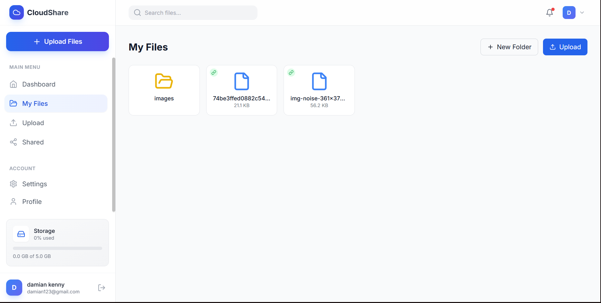
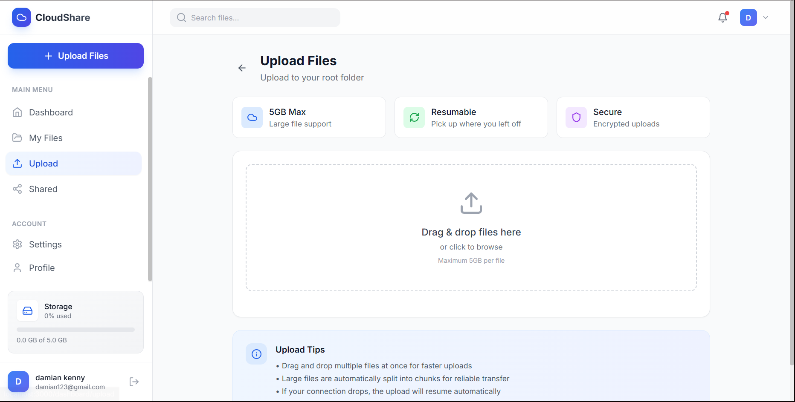

# P2P File Sharing & Management Platform

A high-performance, scalable storage solution designed to handle large file uploads efficiently without taxing server resources.  
This project implements **Direct-to-Cloud Multipart Uploads**, ensuring the Express backend remains a lightweight orchestrator rather than a data bottleneck.

---

## 🚀 Key Architectural Features

### 1. Memory-Efficient Upload Architecture

Traditional servers often crash when handling large files because they attempt to buffer data into RAM.  
This platform solves that by:

- **Chunking**: Breaking large files into 5MB–10MB pieces on the client side.
- **Direct-to-S3**: Bypassing the Node.js server for data transfer. Chunks are sent directly from the browser to S3 via **Presigned URLs**.
- **Resumability**: If the network connection is lost, the upload resumes from the last successful chunk rather than starting over.

### 2. Intelligent Backend Orchestration

The Express server acts as the **Security & Metadata Layer**:

- **Authorization Middleware**: Validates user permissions and storage quotas before authorizing a file upload.
- **AWS SDK Integration**: Generates temporary, time-bound URLs that allow the frontend to interact with S3 securely.
- **S3 Multipart API**: Manages the lifecycle of an upload (`Start → Sign Parts → Complete`).

### 3. Advanced Database Schema (PostgreSQL & Prisma)

- **Hierarchical Folders**: Recursive relationships to support infinite folder nesting.
- **Metadata Management**: Tracks `s3_key`, `mimeType`, `size` (BigInt), and `owner_id`.
- **Relational Integrity**: Ensures every file is linked to a valid user and folder via strict UUID constraints.

---

## 🛠️ Tech Stack

- **Frontend**: Next.js, Tailwind CSS, Uppy.js / Resumable.js
- **Backend**: Node.js, Express, TypeScript
- **Database**: PostgreSQL (Supabase)
- **ORM**: Prisma
- **Storage**: AWS S3 (S3-Compatible Storage via Supabase)
- **Authentication**: JWT-based Authentication

---

## 📂 Project Structure

```plaintext
p2p-file-platform/
├── apps/
│   ├── web/                # Next.js Frontend
│   │   └── src/app/        # App Router (Route Groups for Auth/Dashboard)
│   └── server/             # Express Backend
│       ├── prisma/         # Database Schema
│       └── src/            # Source Code
│           ├── config/     # S3 & DB Configurations
│           ├── middleware/ # Auth & Quota Logic
│           └── routes/     # Orchestration Endpoints
```






## ⚙️ Getting Started

### Prerequisites

- Node.js **v18+**
- Supabase Project (PostgreSQL + S3 Storage enabled)

### Installation

1. **Clone the repository**
2. **Setup Environment Variables**  
   Create a `.env` file in `apps/server`:

```env
DATABASE_URL="your_postgresql_url"
DIRECT_URL="your_direct_db_url"
SUPABASE_S3_ENDPOINT="your_s3_endpoint"
SUPABASE_S3_ACCESS_KEY="your_access_key"
SUPABASE_S3_SECRET_KEY="your_secret_key"
SUPABASE_BUCKET_NAME="files"
```

3. **Install & Run**

```bash
npm install
npx prisma db push
npm run dev
```

---

## 🛡️ Security Implementation

- **Presigned URLs**: Buckets are never publicly writable. Only authenticated users with server-generated signatures can upload.
- **Storage Quotas**: Middleware checks `user.storageUsed` against `user.storageLimit` before allowing uploads to begin.

---

## 📌 Summary

This platform demonstrates a modern, cloud-native approach to large file handling by combining **client-side chunking**, **direct-to-cloud uploads**, and **secure backend orchestration**—resulting in a fast, resilient, and scalable file management system.
